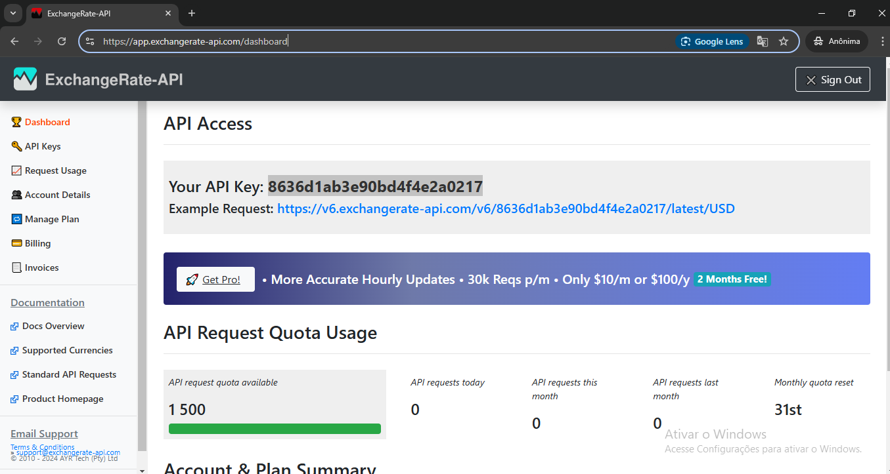
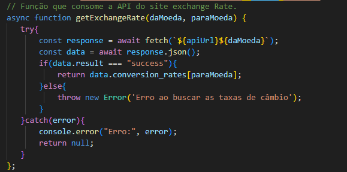
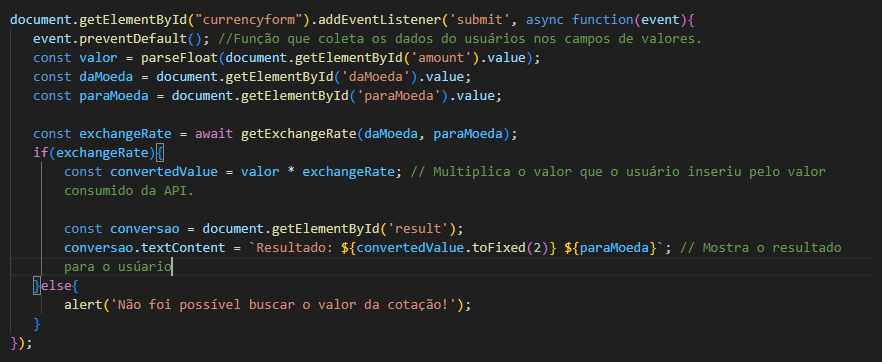

##  CONVERSOR DE MOEDA-API
  ## Descrição Geral
Este projeto é uma evolução de um projeto anterior , com o objetivo de criar uma aplicação web que permite ao usuário converter valores entre diferentes moedas, usando HTML5, CSS3 e JavaScript puro. Diferentemente da versão anterior, este projeto inclui integração com uma API de câmbio para consulta de taxas de conversão em tempo real, garantindo que as cotações estejam sempre atualizadas conforme o mercado.  

## Requisitos Técnicos  
- **HTML5**: Estrutura da página com formulário, permitindo ao usuário inserir o valor e escolher as moedas de origem e destino. Tags semânticas, como `<form>`, `<input>`, e `<select>`, são utilizadas.
- **CSS3**: Estilização da página de forma simples e responsiva para diferentes dispositivos.
- **JavaScript Puro**: Implementação da lógica de integração com a API de câmbio para conversão em tempo real.
## Integração com API
- O projeto utiliza uma API de câmbio (ExchangeRate-API).
- É necessário cadastrar-se nessa plataforma para obter uma chave de API e integrá-la ao projeto.

## Link da API utilizada:
https://app.exchangerate-api.com/dashboard 

## Link do projeto anterior:
https://github.com/HelenaJardimm/ConversorDeMoedas

## Imagem do site utilizado:

## Explicação do código: 

Este código define uma função assíncrona chamada getExchangeRate, que busca a taxa de câmbio entre duas moedas a partir de uma API externa. 

1. Declaração da função getExchangeRate:  
A função getExchangeRate é assíncrona (usando async), o que significa que ela pode fazer chamadas assíncronas e retornar uma Promise.  
Ela recebe dois parâmetros:  
daMoeda: Código da moeda de origem (exemplo: 'USD' para dólar).  
paraMoeda: Código da moeda de destino (exemplo: 'BRL' para real).  

2. Tentativa de buscar dados da API:  

A função utiliza fetch para fazer uma requisição HTTP a uma API de câmbio (o URL da API é representado pela variável apiUrl, e o valor de daMoeda é concatenado ao URL).
await é usado para esperar pela resposta da API antes de prosseguir.

3. Conversão da resposta para JSON:

Após a resposta ser recebida, a função converte a resposta em formato JSON. Isso transforma a resposta da API em um objeto JavaScript.  

4. Verificação de sucesso: 

Se a resposta da API contiver a propriedade result com o valor "success", a função retorna a taxa de câmbio de paraMoeda (usando data.conversion_rates[paraMoeda]).  
Se a resposta não for bem-sucedida, lança um erro com a mensagem 'Erro ao buscar as taxas de câmbio'.  

5. Tratamento de erro:  

Se ocorrer qualquer erro durante o processo (seja na requisição ou na conversão dos dados), o erro será capturado no catch.  
A função exibe o erro no console e retorna null para indicar que a operação não foi bem-sucedida.  

## Explicação do Código

1. Adicionar um ouvinte de evento no formulário:

O código começa adicionando um ouvinte de evento ao formulário com o ID currencyform. Esse ouvinte escuta o evento de envio (submit) do formulário.  
Quando o usuário clica no botão de "submit" ou aperta "Enter", o código entra na função assíncrona que lida com o envio.   

2. Prevenir o comportamento padrão do formulário:

O método event.preventDefault() impede que o formulário seja enviado de maneira tradicional (isto é, sem recarregar a página). Isso permite que a conversão de moeda seja feita via JavaScript sem fazer com que a página seja recarregada.  

3. Coletando os dados do formulário:  

valor: O valor inserido pelo usuário no campo de input com ID amount (ex: o valor que ele deseja converter). O valor é convertido de string para número decimal com parseFloat.
daMoeda: O código da moeda de origem selecionado pelo usuário no campo de seleção com ID daMoeda (ex: 'USD').
paraMoeda: O código da moeda de destino selecionado pelo usuário no campo de seleção com ID paraMoeda (ex: 'BRL').  

4. Chamada para a função getExchangeRate:

A função getExchangeRate é chamada, passando os códigos das moedas (daMoeda e paraMoeda) para obter a taxa de câmbio entre elas.  
O uso de await espera que a função assíncrona getExchangeRate retorne a taxa de câmbio antes de continuar a execução do código.  

5. Realizar a conversão e exibir o resultado:  

Se a função getExchangeRate retornar uma taxa de câmbio válida (ou seja, exchangeRate não for null ou undefined), o código realiza a conversão multiplicando o valor inserido pelo usuário (valor) pela taxa de câmbio obtida.  
O resultado da conversão é então formatado com duas casas decimais (usando toFixed(2)) e exibido no elemento com o ID result na página. A mensagem informando o valor convertido inclui a moeda de destino.  

6. Exibir mensagem de erro caso a API falhe:  

Se a função getExchangeRate não conseguir retornar uma taxa de câmbio válida (por exemplo, se a API falhar ou não retornar a cotação corretamente), um alerta é mostrado para o usuário informando que não foi possível buscar a cotação.  

